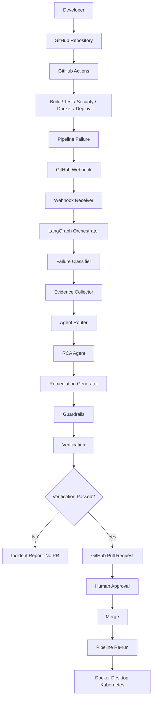
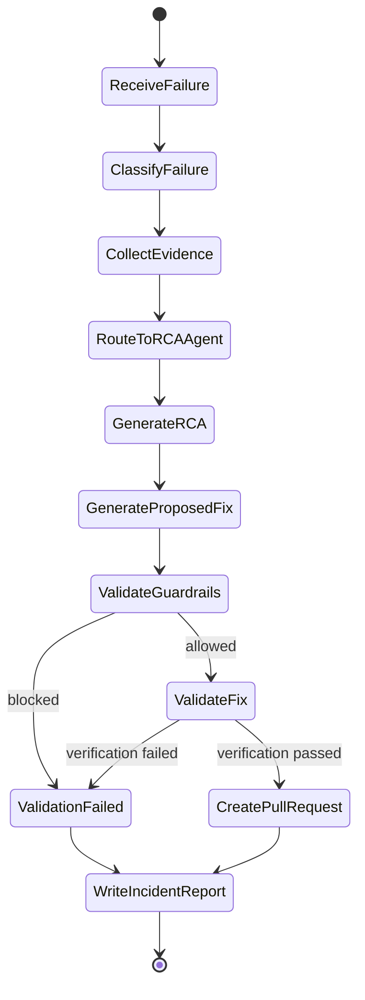

# AI-Assisted Self-Healing CI/CD Platform

Proof of Concept for a local, Docker Desktop Kubernetes-based CI/CD platform where
pipeline failures trigger an AI control plane that collects evidence, performs RCA,
generates a proposed remediation, verifies it, and opens a GitHub Pull Request for
human review.

Phase 1 is intentionally focused on:

```text
FAILURE -> EVIDENCE -> RCA -> REMEDIATION -> VERIFICATION -> PR -> HUMAN APPROVAL
```

The AI control plane must never merge code, bypass review, disable safeguards, or
deploy directly to production.

## Current Phase

The first runnable milestone includes three FastAPI services, unit tests,
Dockerfiles, Kubernetes manifests, and a GitHub Actions workflow.

## Technical Assumptions

- Local runtime target is macOS with Docker Desktop and Kubernetes enabled.
- Python version is 3.12 or newer.
- GitHub Actions is the CI/CD engine.
- Docker images are built locally and pushed to a local registry on
  `localhost:5001` so Docker Desktop Kubernetes can pull them.
- Kubernetes deployment targets Docker Desktop Kubernetes for Phase 1.
- GitHub webhook delivery reaches the local webhook receiver through a tunnel such
  as ngrok or Cloudflare Tunnel.
- GitHub PR creation uses `GITHUB_TOKEN` or a fine-scoped personal access token.
- LLM calls are isolated behind interfaces so tests can mock them.
- RAG is documentation-only in Phase 1, with no vector database dependency.

## Architectural Risks

- GitHub webhooks for workflow failures can be duplicated or delivered out of
  order, so incident idempotency is required.
- GitHub Actions logs can be large and noisy; evidence collection must extract
  focused snippets rather than send entire logs to an LLM.
- Automated remediation can damage project safety if guardrails are too broad, so
  file edits and verification commands must be allowlisted.
- Local Kubernetes state can differ from CI state; deployment verification must
  clearly identify which environment produced the evidence.
- LLM output can be plausible but wrong; structured output, confidence scoring,
  evidence separation, and mandatory verification are required.
- GitHub Actions YAML failures may occur before normal job execution, so evidence
  may be limited to workflow metadata and parser errors.

## Proposed Repository Tree

```text
ai-self-healing-cicd/
├── .github/
│   └── workflows/
├── services/
│   ├── user-service/
│   ├── product-service/
│   └── order-service/
├── kubernetes/
│   ├── user-service/
│   ├── product-service/
│   └── order-service/
├── ai_platform/
│   ├── webhook/
│   ├── orchestrator/
│   ├── classifier/
│   ├── collectors/
│   ├── agents/
│   ├── remediation/
│   ├── verification/
│   ├── github/
│   ├── prompts/
│   ├── models/
│   └── config/
├── knowledge/
│   ├── runbooks/
│   ├── known_issues/
│   └── postmortems/
├── tests/
├── scripts/
├── docs/
├── artifacts/
├── .env.example
├── .gitignore
├── Makefile
├── pyproject.toml
└── README.md
```

## End-to-End Architecture



## LangGraph State Machine Design



State fields:

- `incident_id`
- `repository`
- `workflow_run_id`
- `commit_sha`
- `branch`
- `failed_job`
- `failed_step`
- `failure_category`
- `evidence`
- `root_cause`
- `confidence_score`
- `risk_score`
- `proposed_fix`
- `verification_results`
- `pr_url`
- `status`

## GitHub Actions Stages

1. Checkout
2. Python dependency installation
3. Linting with Ruff
4. Unit tests with pytest
5. Source security scan with Bandit
6. Docker image build
7. Container image security scan with Trivy
8. Kubernetes manifest validation
9. Deployment to Docker Desktop Kubernetes-compatible manifests

Every stage should emit enough metadata to identify workflow, run ID, job, failed
step, commit SHA, branch, repository, and timestamp.

## Failure-To-Agent Routing

| Failure category | Deterministic signals | RCA agent |
| --- | --- | --- |
| `PYTHON_BUILD` | dependency install, import error, package resolution, syntax error | `PythonRCAAgent` |
| `UNIT_TEST` | pytest step, assertion failure, traceback from tests | `TestRCAAgent` |
| `SECURITY` | Bandit or Trivy finding, CVE, severity, rule ID | `SecurityRCAAgent` |
| `DOCKER` | Docker build step, Dockerfile error, missing build context | `DockerRCAAgent` |
| `KUBERNETES` | kubectl apply, dry-run, pod status, manifest validation | `KubernetesRCAAgent` |
| `GITHUB_ACTIONS` | workflow syntax/configuration, missing action, invalid YAML | `GitHubActionsRCAAgent` |
| `UNKNOWN` | no deterministic match | fallback classifier with optional LLM assistance |

## Implementation Phases

- Phase A: Create repository structure and architecture documentation.
- Phase B: Build and test the three FastAPI microservices.
- Phase C: Containerize the services.
- Phase D: Deploy services to Docker Desktop Kubernetes.
- Phase E: Implement GitHub Actions CI/CD.
- Phase F: Implement GitHub webhook receiver.
- Phase G: Implement LangGraph state and failure classifier.
- Phase H: Implement evidence collectors.
- Phase I: Implement RCA agent interface and specialist agents.
- Phase J: Implement remediation generation.
- Phase K: Implement guardrails and verification.
- Phase L: Implement GitHub branch, commit, and PR creation.
- Phase M: Implement controlled failure demonstrations.
- Phase N: Complete tests and documentation.

## Documentation

Detailed design notes are in [docs/architecture.md](docs/architecture.md).

## Local Setup

```bash
python3 -m venv .venv
source .venv/bin/activate
python -m pip install --upgrade pip
python -m pip install -e ".[security]"
```

Run local quality checks:

```bash
make lint
make test
make security
python scripts/validate-kubernetes-manifests.py
```

Build all service images:

```bash
make docker-build
```

Deploy to Docker Desktop Kubernetes:

```bash
chmod +x scripts/deploy-local.sh
./scripts/deploy-local.sh
```

The deploy script starts `ai-platform-registry` on `localhost:5001` when needed,
builds the three service images, pushes them to that local registry, applies the
manifests, restarts deployments, and waits for rollout completion.

Run the same CI/CD path locally inside Docker:

```bash
scripts/run-in-ci-container.sh all
```

This builds a reusable CI toolbox image, runs Python checks, builds and scans all
service images, validates manifests, and applies them to Docker Desktop
Kubernetes. The same local registry is used for image pulls. Trivy cache is
stored in `/tmp/ai-platform-trivy-cache` by default.

Check services:

```bash
kubectl port-forward service/user-service 8001:80
curl http://127.0.0.1:8001/users
```

Use separate terminals or ports for `product-service` and `order-service`.

## Services

| Service | Endpoint |
| --- | --- |
| user-service | `GET /health`, `GET /ready`, `GET /users` |
| product-service | `GET /health`, `GET /ready`, `GET /products` |
| order-service | `GET /health`, `GET /ready`, `GET /orders` |

## GitHub Push

After creating a GitHub repository, set the remote and push:

```bash
git remote add origin git@github.com:<owner>/<repo>.git
git branch -M main
git push -u origin main
```

## RCA-To-PR Control Plane

The first AI control-plane slice is implemented under `ai_platform/`. It is
deterministic by default and uses LangGraph for orchestration.

Current flow:

```text
workflow failure metadata
  -> signature/webhook parsing
  -> failure classifier
  -> focused evidence collector with secret redaction
  -> RCA agent router
  -> specialist RCA agent
  -> remediation proposal
  -> guardrail validation
  -> allowlisted verification
  -> GitHub Pull Request plan or PR creation
```

The RCA agent does not directly create a PR. It returns structured RCA output with
observed evidence, inference, recommended fix, confidence, risk, and files to
modify. The remediation and verification layers decide whether a PR can be raised.

Supported deterministic routing:

| Category | Agent |
| --- | --- |
| `PYTHON_BUILD` | `PythonRCAAgent` |
| `UNIT_TEST` | `TestRCAAgent` |
| `SECURITY` | `SecurityRCAAgent` |
| `DOCKER` | `DockerRCAAgent` |
| `KUBERNETES` | `KubernetesRCAAgent` |
| `GITHUB_ACTIONS` | `GitHubActionsRCAAgent` |
| `UNKNOWN` | `UnknownRCAAgent` |

PR creation remains human-in-the-loop:

- The AI creates a branch like `ai-remediation/<incident-id>`.
- It commits only verified changed files.
- It opens a PR with RCA, evidence, risk, confidence, and verification results.
- It never merges the PR.

Local Ollama is used for RCA enrichment when available:

```bash
ollama list
export LLM_PROVIDER=ollama
export LLM_MODEL=qwen2.5:3b
export OLLAMA_BASE_URL=http://host.docker.internal:11434
```

The deterministic classifier still selects exactly one specialist agent first.
Ollama receives only focused, redacted evidence and improves the RCA text; if
Ollama is unavailable, the deterministic RCA result is used.
